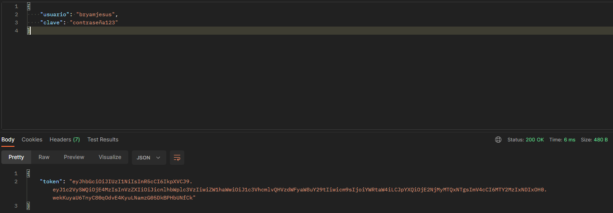
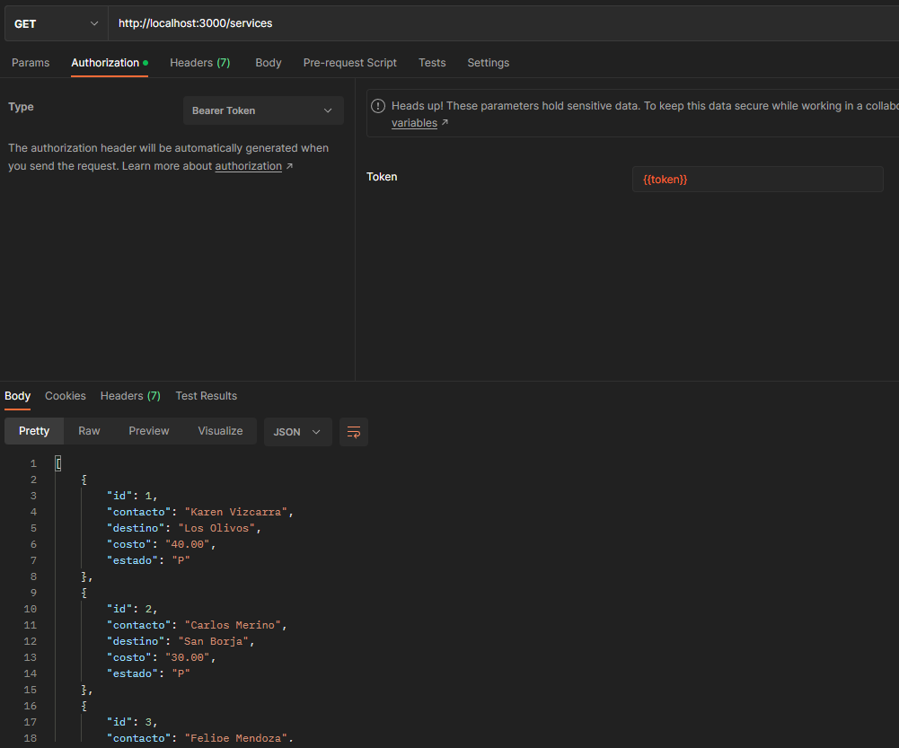
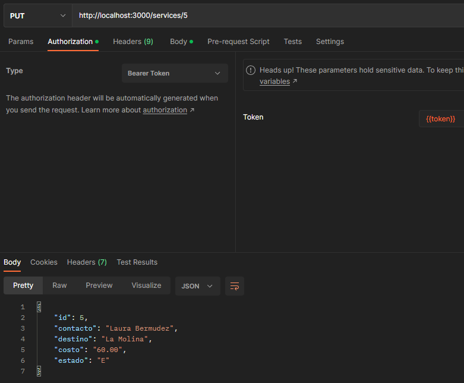
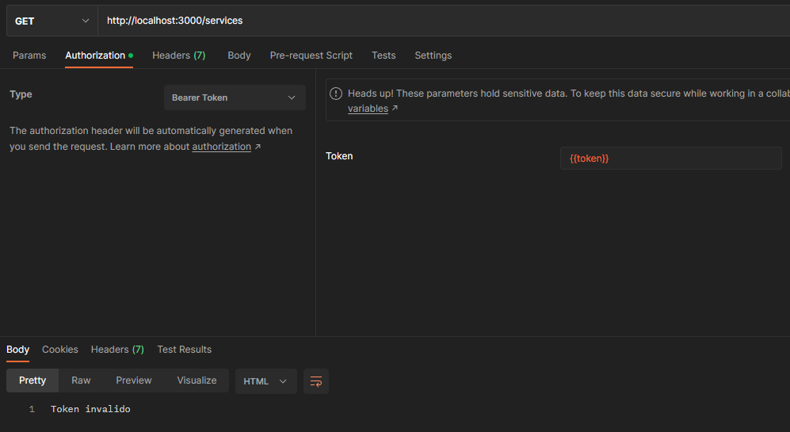

# Currier - API

## Instalación ⬇
Descarga el proyecto y en la ruta abre su termina e ingresa el siguiente comando.
```bash
npm install
```
## Login
Al momento de hacer el login este te regresa un TOKEN


## Acciones
Al momento de generar el token podemos realizar las demas acciones




## Pasado un tiempo ⌛
Una vez pasado este tiempo (1 minuto) este ya no te permitirá realizar acciones

